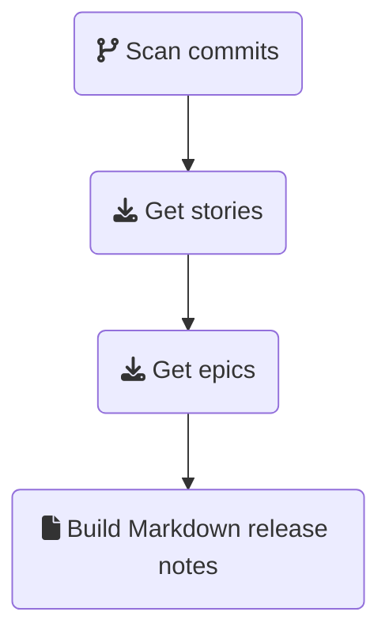

# Shortcut release helper

This is a command-line tool to retrieve the list of stories from the
[Shortcut](https://app.shortcut.com/) issue tracker which will be deployed in
a release, and generate release notes based on a template.



For each repository listed in its configuration file, it scans the commits
which are present in the "next" branch (which is the branch/commit to be
released) and absent from the "release" branch (which the branch/commit already
released). All Shortcut stories matching commits with a message starting with
`[sc-<shortcut_id>]` are retrieved from Shortcut, along with the epic they
belong to.

Finally, a Markdown file is generated based on the retrieved data and a template.

# Usage

```bash
$ shortcut_release_helper --version 3.22.1 --name "My new release" notes.md
```

## Configuration

The software expects a `config.toml` configuration file in the current folder.

It has the following format:

```toml
# Shortcut API token, see https://help.shortcut.com/hc/en-us/articles/205701199-Shortcut-API-Tokens
api_key = "<your_api_key>"

# Template file, see below
template_file = "template.md.jinja"

# A list of one or more repository
[repositories]
repo1_name = { location = "<path_to_the_repo>", release_branch = "<branch_name_or_commit>", next_branch = "<branch_name_or_commit>" }
repo2_name = { location = "<path_to_the_repo>", release_branch = "<branch_name_or_commit>", next_branch = "<branch_name_or_commit>" }
repo3_name = { location = "<path_to_the_repo>", release_branch = "<branch_name_or_commit>", next_branch = "<branch_name_or_commit>" }
```

The `path_to_the_repo` may be absolute or relative to the current directory.

## Building the template

The template file is a Jinja Markdown template, which lays out the data retrieved from Shortcut.

### Input data

The template receives the following data:

| Field name | Type | Description |
| -- | -- | -- |
| `name` | `string` or `undefined` | the name of the release, passed on the command line |
| `version` | `string` or `undefined` | the version of the release, passed on the command line |
| `description` | `string` or `undefined` | the description of the release, passed on the command line |
| `stories` | `list` of [Shortcut stories](https://shortcut.com/api/rest/v3#Body-Parameters-37290) | the list of all stories which been worked in the release |
| `epics` | `list` of [Shortcut epics](https://shortcut.com/api/rest/v3#Get-Epic) | the list of all Shortcut epics containing at least one of the `stories` above (note that the epic's `stats` field relates to all the stories in the epic, not just the ones missing from the "release" branch) |
| `unparsed_commits` | `map` `string` -> `list` of [commits](https://docs.rs/git2/latest/git2/struct.Commit.html) | a map of repo name to a list of commits with a commit message **not** starting with a valid Shortcut issue number |
| `heads` | `map` `string` -> [commit](https://docs.rs/git2/latest/git2/struct.Commit.html) | a map of repo name to the head commit of the release branch of each repository |


### Helpers

The template receives the following helpers:

| Name | Description | Example |
| -- | -- | -- |
| `split_by_epic_stories_state` | Given a list of epics, returns a 2-elements list where the first element contains all epics for which all stories are in a Done state, and the rest of the epics in the second item | `` |
| `split_by_label` | Given a list of epics or stories and a label name, returns a 2-elements list where the first element contains all items with the label, and the second all items without it | `` |
| `split_by_epic` | Given a list of stories and an epic id, returns a 2-elements list where the first element contains all stories belonging to the epic, and the second all stories without it | `` |
| `story_emoji` | Given a story, returns a [Github emoji](https://github.com/ikatyang/emoji-cheat-sheet/) matching the type of story (:sunny: feature, :lady_beetle: bug or :wrench: chore) | `{{ story \| story_emoji }}` |
| `indent` | Given a string and a number *S*, indents all lines of the text by *S* spaces | `  - {{ commit.message \| indent(4) }}` |
| `escape` | Escapes special Markdown characters in the text (useful for Shortcut epic and story titles, as well as Git commit messages) | `{{ epic.title \| escape }}` |

### Functions

The template receives the following functions:

| Name | Description | Example |
| -- | -- | -- |
| `today` | Returns today's date in `YYYY-MM-DD` format | `{{ today() }}` |
| `epic_emoji` | Returns a :checkered_flag: flag emoji | `{{ epic_emoji() }}` |

## Jinja syntax

The Markdown template uses a subset of the Jinja 2 syntax, as implemented in the [minijinja](https://docs.rs/minijinja/latest/minijinja/) crate.

# Development

## Dependencies

### Utilities

- [Open API generator](https://github.com/OpenAPITools/openapi-generator).
  This will be used to generate the Shortcut client, based on the OpenAPI
  definition available from the [Shortcut API documentation
  site](https://shortcut.com/api/rest/v3). The project's generator script
  expects an `openapi-generator-cli` in the `PATH`.
- [curl](https://curl.se/), to download the Shortcut OpenAPI definition.
- [jq](https://stedolan.github.io/jq/), to patch it.
- [git](https://git-scm.com/), obviously
- [rustc](https://www.rust-lang.org/), at least 1.58.0

### Libraries

- [OpenSSL](https://www.openssl.org/)

## Building

Clone the repository.

Generate the OpenAPI client via `./bin/generate_openapi_client.sh`.

Build the application via `cargo build`
